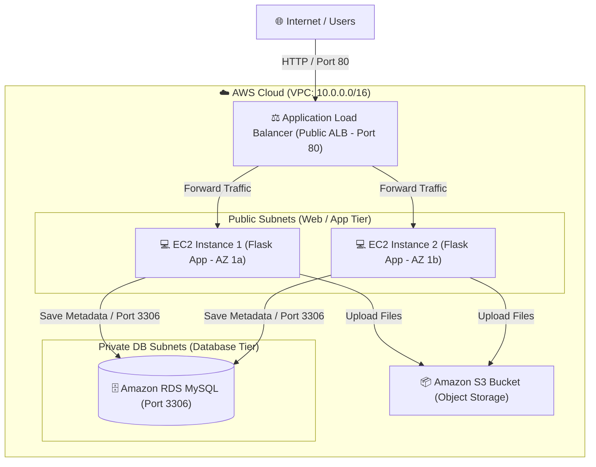

# cloud-vault-app
AWS-Terraform Project

# ☁️ Cloud File Vault — 3-Tier AWS Architecture with Terraform

An enterprise-grade, high-availability 3-tier web application deployed on AWS using **Terraform** (IaC). The platform enables secure file uploads to **Amazon S3** while recording file metadata inside an **Amazon RDS (MySQL)** database.

---

## 🏗️ System Architecture


* **Frontend / App Tier:** Python Flask web server deployed on EC2 instances within an **Auto Scaling Group (ASG)** behind an **Application Load Balancer (ALB)**.
* **Database Tier:** **Amazon RDS MySQL** instance deployed in private database subnets across multiple Availability Zones.
* **Storage Tier:** **Amazon S3** bucket for object storage.
* **Security:** Strict Security Group isolation and IAM Instance Profiles following the principle of least privilege.

## 📁 Repository Structure:

├── app.py                  # Python Flask web application code
├── requirements.txt        # Application dependencies (Flask, boto3, pymysql)
├── compute.tf              # ALB, Target Group, Launch Template, and ASG configuration
├── database.tf             # RDS MySQL Instance & DB Subnet Group configuration
├── iam.tf                  # IAM Roles & S3 access policies for EC2
├── outputs.tf              # Terraform outputs (ALB DNS endpoint)
├── providers.tf            # AWS Provider & Remote State backend configuration
├── s3.tf                   # Amazon S3 Bucket creation for vault storage
├── security_groups.tf      # Firewall rules for ALB, App Tier, and RDS DB
├── variables.tf            # Project variables and database configurations
└── vpc.tf                  # Custom VPC, Public/Private Subnets, IGW, and Route Tables

---

## 🚀 Key Features

* **Infrastructure as Code (IaC):** 100% automated infrastructure provisioning using Terraform.
* **Auto Healing & Scaling:** Auto Scaling Group automatically launches replacement instances upon failure.
* **Secure Storage:** Direct file stream uploads to S3 with explicit Content-Type handling.
* **Dynamic Record Tracking:** Metadata (filename, S3 direct URL, timestamp) indexed directly inside MySQL RDS.

---

## 🛠️ Prerequisites

* [Terraform CLI](https://developer.hashicorp.com/terraform/downloads) (v1.0.0+)
* [AWS CLI](https://aws.amazon.com/cli/) configured with proper administrative privileges
* Python 3.10+ (for local testing)

---

## 💻 Quickstart Deployment Guide

### 1. Clone the Repository
```bash
git clone [https://github.com/naveen95662/cloud-vault-app.git](https://github.com/naveen95662/cloud-vault-app.git)
cd cloud-vault-app

2. Initialize Terraform
terraform init

3. Plan Infrastructure
terraform plan

4. Deploy Infrastructure
terraform apply

5. Access the Web Application
terraform output alb_dns_name
Open the returned URL in your browser to view and use the Cloud File Vault UI.

🧹 Teardown
To destroy all provisioned AWS resources and avoid unexpected AWS charges, run:

terraform destroy
